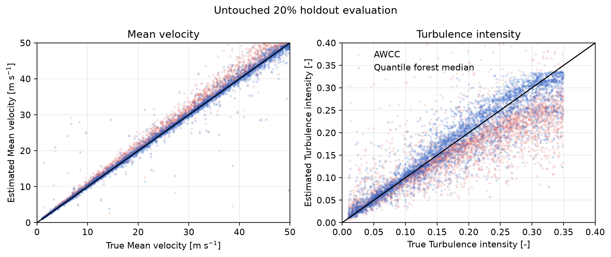
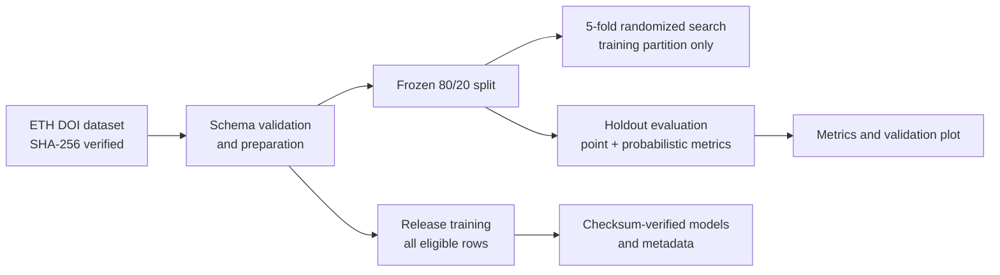

# pdp-uq

Bias correction and uncertainty quantification for dual-tip phase-detection
probe measurements processed with Adaptive Window Cross-Correlation (AWCC).
The project packages the quantile-regression-forest model published with
Bürgler et al. (2024) and provides a reproducible path from the immutable
simulation dataset to evaluated model artifacts.

[](https://github.com/mattbuergler/pdp-uq/actions/workflows/ci.yml)
[](https://www.python.org/)
[](LICENSE)
[](https://doi.org/10.1016/j.ijmultiphaseflow.2024.104978)
[](https://doi.org/10.3929/ethz-b-000664463)



## What the model delivers

Two quantile forests correct the AWCC estimates of:

- mean streamwise velocity, in m/s;
- streamwise turbulence intensity, dimensionless.

Each prediction includes the median, interquartile range, 90% interval, and
additional tail quantiles. Rows outside the published application domain are
flagged and receive no model prediction.

The current reproducible holdout run uses 15,238 training rows and 3,810 test
rows. These results are generated from `dvc.lock`, not copied from the paper:

| Target | AWCC RMSE | Model RMSE | RMSE reduction | Model R² | 90% interval coverage |
| --- | ---: | ---: | ---: | ---: | ---: |
| Mean velocity | 10.291 m/s | 1.595 m/s | 84.5% | 0.987 | 92.1% |
| Turbulence intensity | 0.0822 | 0.0355 | 56.8% | 0.866 | 93.2% |

The unusually large baseline velocity RMSE reflects rare but extreme AWCC
failures retained in the published simulation data. MAE, interval widths, all
pinball losses, and exact provenance are available in
`reports/generated/metrics.json` after reproduction. See the
[model card](docs/model-card.md) before applying the model to measurements.

## Quick start

Install [uv](https://docs.astral.sh/uv/), clone the repository, and create the
locked environment:

```bash
git clone https://github.com/mattbuergler/pdp-uq.git
cd pdp-uq
uv sync --locked --all-extras
uv run dvc repro train
```

Apply the model to the included profile:

```bash
uv run pdp-uq predict example/pdp_data.csv \
  --dx 0.005 \
  --dy 0.001 \
  --particles-per-window 10 \
  --output example/pdp_data_uq.csv

uv run pdp-uq plot example/pdp_data_uq.csv \
  --output example/profiles_uq.png
```

On PowerShell, use the same commands on one line or replace `\` with the
PowerShell continuation character.

The input CSV must contain:

| Column | Meaning |
| --- | --- |
| `u [m/s]` | AWCC mean streamwise velocity |
| `u_rms [m/s]` | RMS streamwise velocity fluctuation |
| `c [-]` | air concentration |
| `d_32a [m]` | Sauter mean air-chord diameter |

The latter can be estimated as `d_32a = 1.5 * u * c / F`, where `F` is the
bubble count rate.

## Python API

```python
from pathlib import Path

from pdp_uq.inference import PredictionConfig, predict_file

output = predict_file(
    Path("measurements.csv"),
    PredictionConfig(
        delta_x=0.005,
        delta_y=0.001,
        particles_per_window=10,
    ),
    model_directory=Path("data"),
)
print(output)
```

Model files are checksum-verified against `data/model_metadata.json` before
deserialization. Only load model artifacts produced by this repository.

## Application guard

The CLI validates the available measured quantities and probe settings against
the maintained model's conservative inference guard:

| Feature | Supported range |
| --- | ---: |
| Mean velocity | 1-50 m/s |
| Turbulence intensity | 0.01-0.35 |
| Air concentration | 0.005-0.4 |
| Sauter mean diameter | 0.5-20 mm |
| Streamwise tip separation | 0.5-10 mm |
| Lateral tip separation | 0-2 mm |
| Particles per AWCC window | 5-20 |

These bounds do not make extrapolation scientifically valid. They are guards
derived from the model-development configuration and available measurements.
The publication's limitations still apply, including its synthetic spherical
bubbles, no-slip assumption, ideal point probes, and omission of
bubble-probe interaction and intrusive effects.

## Reproducible ML pipeline



The routine paper-aligned build uses the fixed released hyperparameters and
does not need to repeat the expensive search:

```bash
uv run dvc repro evaluate train
uv run dvc metrics show
```

To repeat the paper's 300-iteration, five-fold randomized search:

```bash
uv run dvc repro dvc-tune.yaml
```

The search sees only the training partition. The untouched holdout is used
once for evaluation, avoiding test-set leakage. Full commands, artifact
lineage, and expected runtimes are documented in
[Reproducibility](docs/reproducibility.md).

## Engineering quality

```bash
uv run ruff check .
uv run ruff format --check .
uv run mypy src
uv run pytest
uv build
```

The package uses a `src/` layout, typed public inference API, atomic output
writes, explicit schemas and domain warnings, checksum-verified acquisition,
deterministic splits, DVC lineage, test coverage enforcement, and a
multi-version GitHub Actions workflow.

## Scientific record

- [Paper included in this repository](docs/Buergler_et_al_2024_Uncertainties.pdf)
- [Journal article](https://doi.org/10.1016/j.ijmultiphaseflow.2024.104978)
- [Simulation dataset](https://doi.org/10.3929/ethz-b-000664463)
- [Model card](docs/model-card.md)
- [Data card](docs/data-card.md)
- [Contributing guide](CONTRIBUTING.md)

Please cite both the article and dataset; machine-readable citation metadata is
provided in [`CITATION.cff`](CITATION.cff).
